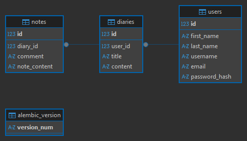

# Flask Diary Web Application

A simple web application for managing diaries and notes built with Flask.

## Tech Stack
- Python
- Flask
- SQLAlchemy
- PostgreSQL
- Alembic
- Flask-Login
- Jinja2
- HTML
- Git
- Pytest

## Features

-  User registration and authentication (Flask-Login)
-  User profile management (edit, delete account)
-  Diary management system
-  CRUD operations for notes (create, read, update, delete)
-  One-to-Many relationships (User → Diaries → Notes)
-  PostgreSQL database integration via SQLAlchemy ORM
-  Database migrations using Alembic
-  Data validation and error handling
-  HTML templates with Jinja2
-  Automated tests with Pytest and Flask Test Client

## Database Diagram

## Project Purpose

This project was created to practice backend development with Flask, including authentication, database design, and testing.

---

##  Author

**Sofia Sudarkova**

GitHub: https://github.com/Sofia-so  
Email: sudarkovasofia0@gmail.com
