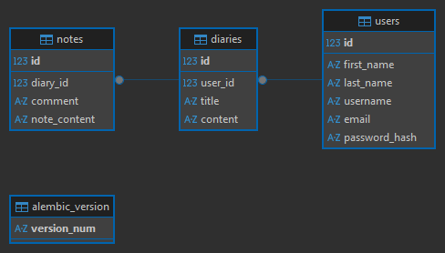

# Flask Diary Web Application

[](https://github.com/Sofia-so/pet_projects/actions/workflows/tests.yml)

A simple web application for managing diaries and notes built with Flask.

## Tech Stack
- Python
- Flask
- SQLAlchemy
- PostgreSQL
- Alembic
- Flask-Login
- Jinja2
- HTML
- Git
- Pytest
- GitHub Actions
- Docker / Docker Hub

## Features

-  User registration and authentication (Flask-Login)
-  User profile management (edit, delete account)
-  Diary management system
-  CRUD operations for notes (create, read, update, delete)
-  One-to-Many relationships (User → Diaries → Notes)
-  PostgreSQL database integration via SQLAlchemy ORM
-  Database migrations using Alembic
-  Data validation and error handling
-  HTML templates with Jinja2
-  Automated tests with Pytest and Flask Test Client
-  Containerized application with Docker
 
 ## Continuous Integration
 
The project uses GitHub Actions to:
- automatically install dependencies;
- run Alembic database migrations;
- execute the Pytest test suite;
- verify every push and pull request.

## Deployment

The application is deployed on Render.

Live application:  
https://pet-projects-4g7e.onrender.com

## Database Diagram



## Project Purpose

This project was created to practice backend development with Flask, including authentication, database design, and testing.

## Getting Started

### Clone the repository

```bash
git clone https://github.com/Sofia-so/pet_projects.git
cd pet_projects
```

### Create and activate a virtual environment

```bash
python -m venv .venv
```

**Windows**

```bash
.venv\Scripts\activate
```

**Linux / macOS**

```bash
source .venv/bin/activate
```

### Install dependencies

```bash
pip install -r requirements.txt
```

### Configure environment variables

Create a `.env` file based on `.env.example`.

### Apply database migrations

```bash
alembic upgrade head
```

### Run the application

```bash
flask --app app:create_app --debug run
```

### Build the image

```bash
docker build -t flask-diary .
```
### Run the container

```bash
docker run -p 5001:5000 \
  -e PORT=5000 \
  -e DATABASE_URI="your_database_uri" \
  pet_projects-web
```

## License

No license has been specified for this project.
---

## Author

**Sofia Sudarkova**

GitHub: https://github.com/Sofia-so  
Email: sudarkovasofia0@gmail.com
